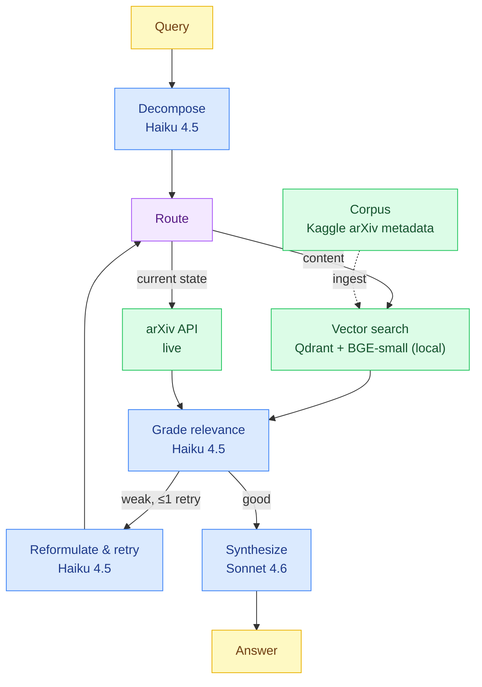

# arXiv Hybrid RAG Agent

A research assistant over arXiv papers that combines retrieval-augmented generation with an agentic workflow. Given a question, it decomposes the query into sub-questions, routes each to the right source (semantic search over a local vector store, or the live arXiv API) grades the retrieved context, retries once if the context is weak, and synthesizes a cited answer.

The paper *content* lives in a vector store and is answered by RAG, while *current state* (what was published recently, papers by an author, lookups by ID) is answered by a live API. An agent decides which a given sub-question needs.

For the reasoning behind each technical decision, see [`docs/ADR.md`](docs/ADR.md).

## Features

- **Query decomposition:** multi-part questions are split into sub-queries and handled independently.
- **Tool routing:** each sub-query is routed to vector search or the live arXiv API.
- **Corrective retrieval:** retrieved context is graded for relevance; weak results trigger a single bounded re-retrieval.
- **Local embeddings, API generation:** embeddings run locally (no per-query embedding cost, retrieval works offline); answer synthesis uses a hosted LLM.
- **Tiered models:** a cheaper model handles decomposition and grading; a stronger model handles synthesis.
- **Graceful degradation:** API and tool failures fall back rather than crash.

## How it works



## Prerequisites

- Python 3.12+
- [uv](https://github.com/astral-sh/uv) for dependency management
- Docker (for running Qdrant locally)
- An Anthropic API key

## Setup

```bash
# 1. Clone and install dependencies
git clone <repo-url>
cd arxiv-hybrid-rag
uv sync

# 2. Configure environment
cp .env.example .env
# edit .env and add your ANTHROPIC_API_KEY

# 3. Start Qdrant
.\make.ps1 up          # Windows
make up                # Linux/macOS

# 4. Download the corpus
# Download the arXiv metadata JSON from Kaggle:
# https://www.kaggle.com/datasets/Cornell-University/arxiv
# and place it at the path set in .env
# (default: _data/arxiv-metadata-oai-snapshot.json)
# Lower the MAX_PAPERS param to 5000 in .env if you are on cpu
# and dont have a whole afternoon :)
```

## Usage

There are two ways to run the application, depending on how much you want to
containerize. Both are driven by the `Makefile` (use `make.ps1` on Windows).

| Target                   | Description                                  | `make` (Linux/macOS)        | `make.ps1` (Windows)                        |
|--------------------------|----------------------------------------------|-----------------------------|---------------------------------------------|
| Build app image          | Build the app container image                | `make build`                | `.\make.ps1 build`                          |
| Start Qdrant             | Start the vector store container             | `make up`                   | `.\make.ps1 up`                             |
| Start Qdrant + app       | Start both services                          | `make up SERVICE=all`       | `.\make.ps1 up -Service all`                |
| Stop all services        | Stop and remove containers                   | `make down`                 | `.\make.ps1 down`                           |
| Ingest (host)            | Build the index on the host via `uv`         | `make ingest`               | `.\make.ps1 ingest`                         |
| Ingest (Docker)          | Build the index inside the app container     | `make ingest-docker`        | `.\make.ps1 ingest-docker`                  |
| Ask (host)               | Ask a question on the host via `uv`          | `make run Q="..."`          | `.\make.ps1 run -Q "..."`                   |
| Ask (Docker)             | Ask a question inside the app container      | `make run-docker Q="..."`   | `.\make.ps1 run-docker -Q "..."`            |
| Test                     | Run the test suite (host)                    | `make test`                 | `.\make.ps1 test`                           |
| Eval                     | Generate an eval set and score it with Ragas | `make eval`                 | `.\make.ps1 eval`                           |

### Option 1 — Qdrant in Docker, app on the host

Run only Qdrant in a container; the app runs directly on your machine via `uv`.
This is the lightest setup and the fastest for development — there is no app
image to build, and the app talks to Qdrant at `http://localhost:6333` (the
default `QDRANT_URL`).

```bash
make up        # start Qdrant
make ingest    # build the index (filter, embed, upsert to Qdrant)
make run Q="What does the original transformer paper propose, and what recent papers improve on its attention mechanism?"
```

On Windows:
```powershell
.\make.ps1 up
.\make.ps1 ingest
.\make.ps1 run -Q "What does the original transformer paper propose, and what recent papers improve on its attention mechanism?"
```

### Option 2 — Qdrant and the app both in Docker

Run everything in containers. The app is packaged as a container image (see
`Dockerfile`) and `docker-compose.yml` runs it alongside Qdrant. Use the
`-docker` targets so the app runs inside the container instead of on the host.

```bash
make build         # build the app image
make up            # start Qdrant
make ingest-docker # build the index (runs inside the container, uses running Qdrant)
make run-docker Q="What does the original transformer paper propose, and what recent papers improve on its attention mechanism?"
```

On Windows:
```powershell
.\make.ps1 build
.\make.ps1 up
.\make.ps1 ingest-docker
.\make.ps1 run-docker -Q "What does the original transformer paper propose, and what recent papers improve on its attention mechanism?"
```

Inside the container, Qdrant is reached at `http://qdrant:6333` (the compose
service name) rather than `localhost` — this is set via the compose
`environment` block, so no change to your `.env` is needed for the
containerized path.

### Testing & evaluation

The test and eval targets run on the host via `uv` in both options:

```bash
make test          # run the test suite
make eval          # generate an eval set and score it with Ragas
```

### Configuration

All configuration is read from environment variables via `src/arxiv_rag/config.py`. Key settings:

| Variable            | Description                          | Default                  |
|---------------------|--------------------------------------|--------------------------|
| `ANTHROPIC_API_KEY` | API key for answer generation        | _(required)_             |
| `SYNTH_MODEL`       | Model used for synthesis             | `claude-sonnet-4-6`      |
| `GRADER_MODEL`      | Model used for grading/decomposition | `claude-haiku-4-5`       |
| `EMBEDDING_MODEL`   | Local embedding model                | `BAAI/bge-small-en-v1.5` |
| `ARXIV_CATEGORY`    | Corpus category filter               | `cs.LG`                  |
| `TOP_K`             | Chunks retrieved per sub-query       | `5`                      |
| `MAX_RETRIES`       | Corrective re-retrieval cap          | `1`                      |
| `QDRANT_URL`        | Qdrant endpoint                      | `http://localhost:6333`  |

See `.env.example` for the full list.

## Project structure

```
src/arxiv_rag/
├── config.py        # centralized settings (env vars, model names, thresholds)
├── domain/          # core types — Paper, Chunk, SubQuery, AgentState
├── ingestion/       # offline: load + filter corpus, embed, index
├── retrieval/       # embedder + vector store (behind protocols)
├── tools/           # vector_search, arxiv_api (behind a Tool protocol)
├── llm/             # provider-agnostic LLM client + prompts
├── agent/           # LangGraph nodes, graph wiring, routing logic
└── app.py           # CLI entrypoint

eval/                # synthetic dataset generation + Ragas metrics
tests/               # unit (deterministic) + integration (end-to-end)
```

Components are defined behind protocols (`Embedder`, `VectorStore`, `LLMClient`, `Tool`), so swapping an embedding model, vector store, or LLM provider is a single-class change.

The app is containerized via `Dockerfile`; `docker-compose.yml` runs it alongside Qdrant.

## Testing & evaluation

Two layers:

- **Unit tests** — deterministic tests for ingestion, the arXiv API tool's error handling, prompt parsing, and the retry-cap logic. LLM and network calls are mocked.
- **RAG evaluation** — faithfulness, answer relevance, and context precision, measured with [Ragas](https://github.com/explodinggradients/ragas) over a synthetic evaluation set generated from the corpus. Agent routing and the corrective loop are tested separately.

Results are written to `eval/results/`. Sample scores and example runs are in [`docs/demo.md`](docs/demo.md).
